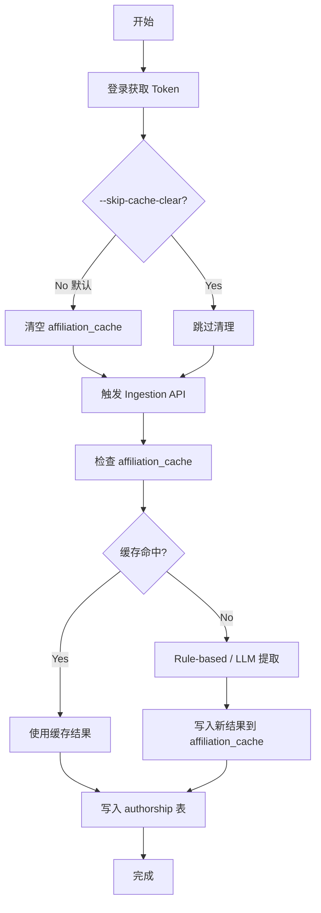

# Trigger Ingestion Script Update

## 📝 更新内容

### 1️⃣ **移除无用的 `--force` 参数**

**原因**：
- 后端的 `force_refresh` 参数被标记为 "Ignored, always fresh"
- 该参数在当前实现中没有实际作用
- 保留它会误导用户

**修改**：
- ✅ 移除了 `--force` / `force_refresh` 参数
- ✅ 简化了代码逻辑

---

### 2️⃣ **新增自动清空 `affiliation_cache` 功能**

**问题**：
- Ingestion 优先使用 `affiliation_cache` 中的缓存结果
- 即使修复了解析 bug（如 Ltd 问题），已缓存的错误结果仍会被使用
- 之前需要手动清空缓存才能重新解析

**解决方案**：
- ✅ 脚本**默认自动清空该 run 的 affiliation_cache**
- ✅ 确保每次 ingestion 都使用最新的解析逻辑
- ✅ 新增 `--skip-cache-clear` 选项（需要快速重跑时可以跳过清理）

---

## 🔧 新功能详解

### 自动清空缓存机制

**实现逻辑** (`clear_run_affiliation_cache` 函数)：

```python
async def clear_run_affiliation_cache(run_id: str) -> int:
    """
    清空特定 run 的 affiliation_cache 条目。
    
    SQL 查询逻辑：
    1. 从 authorship 表获取该 run 的所有 affiliation
    2. 在 affiliation_cache 表中删除这些 affiliation 的缓存
    3. 返回删除的条目数量
    """
```

**SQL 查询**：
```sql
WITH run_affiliations AS (
    SELECT DISTINCT unnest(string_to_array(affiliation_raw_joined, ' | ')) AS aff
    FROM authorship a
    JOIN run_papers rp ON a.pmid = rp.pmid
    WHERE rp.run_id = :run_id
      AND affiliation_raw_joined IS NOT NULL
      AND affiliation_raw_joined != ''
)
DELETE FROM affiliation_cache
WHERE affiliation_raw IN (SELECT aff FROM run_affiliations WHERE aff IS NOT NULL AND aff != '')
RETURNING affiliation_raw
```

**特点**：
- ✅ **精确清理**：只删除该 run 相关的缓存（不影响其他 run）
- ✅ **安全性**：使用事务确保数据一致性
- ✅ **透明性**：显示清理的条目数量

---

## 📖 使用方法

### 基本用法（默认行为）

```bash
# 自动清空缓存并重新 ingestion
python scripts/trigger_ingestion.py <project_id> <run_id> \
    --email user@example.com \
    --password mypassword
```

**输出示例**：
```
Logging in as user@example.com...
✅ Login successful

🧹 Clearing affiliation_cache for run run_7b1d4766fd27...
   ✅ Cleared 245 cached affiliation(s)
   → Affiliations will be re-parsed with latest extraction logic

🚀 Triggering ingestion for run run_7b1d4766fd27...
...
```

---

### 跳过缓存清理（快速模式）

```bash
# 使用已有缓存（更快，但不会重新解析）
python scripts/trigger_ingestion.py <project_id> <run_id> \
    --email user@example.com \
    --password mypassword \
    --skip-cache-clear
```

**输出示例**：
```
Logging in as user@example.com...
✅ Login successful

⚠️  Skipping cache clear (--skip-cache-clear enabled)
   → Existing cached affiliations will be reused (faster, but won't re-parse)

🚀 Triggering ingestion for run run_7b1d4766fd27...
...
```

**适用场景**：
- ✅ 测试其他功能（不需要重新解析 affiliation）
- ✅ 快速重跑（已确认 affiliation 解析正确）
- ✅ 数据恢复（只需要恢复 authorship 表数据）

---

### 使用 Token（无需密码）

```bash
python scripts/trigger_ingestion.py <project_id> <run_id> \
    --token eyJhbGciOiJIUzI1NiIsInR5cCI6IkpXVCJ9...
```

---

### 自定义后端 URL

```bash
python scripts/trigger_ingestion.py <project_id> <run_id> \
    --email user@example.com \
    --password mypassword \
    --base-url https://api.example.com
```

---

## 🎯 实际应用场景

### 场景 1: 修复 Ltd 公司名称解析错误

**背景**：修复了 Ltd 解析 bug 后，需要重新解析已缓存的 affiliation。

**操作**：
```bash
# 1. 默认行为会自动清空该 run 的缓存
python scripts/trigger_ingestion.py 6af7ac1b6254 13092a22728c \
    --email xiaolongwu0713@gmail.com \
    --password xiaowu

# 2. 新解析的结果会使用修复后的逻辑
#    "Neuroxess Co., Ltd." 会被正确识别为机构名（而不是 "Ltd"）
```

**效果**：
- ✅ 清空旧的错误缓存（如 `institution="Ltd"`）
- ✅ 使用新的解析逻辑重新提取
- ✅ 新结果写入缓存（`institution="Neuroxess Co Ltd"`）

---

### 场景 2: 调试时快速重跑

**背景**：调试后端代码时需要多次重跑 ingestion，但 affiliation 解析已经正确。

**操作**：
```bash
# 使用 --skip-cache-clear 跳过清理，加快速度
python scripts/trigger_ingestion.py 6af7ac1b6254 13092a22728c \
    --email xiaolongwu0713@gmail.com \
    --password xiaowu \
    --skip-cache-clear
```

**效果**：
- ✅ 跳过缓存清理（节省时间）
- ✅ 直接使用已有的 affiliation 解析结果
- ✅ 更快完成 ingestion（适合快速迭代）

---

### 场景 3: 更新配置后重新解析

**背景**：修改了 `config.py` 中的 affiliation 提取方法（从 rule-based 切换到 LLM）。

**操作**：
```bash
# 修改 config.py
# affiliation_extraction_method = "llm"  # 从 "rule_based" 改为 "llm"

# 重新运行 ingestion（自动清空缓存）
python scripts/trigger_ingestion.py 6af7ac1b6254 13092a22728c \
    --email xiaolongwu0713@gmail.com \
    --password xiaowu
```

**效果**：
- ✅ 清空所有缓存的 affiliation
- ✅ 使用新的提取方法（LLM）重新解析
- ✅ 新结果写入缓存

---

## ⚠️ 注意事项

### 1. 缓存清理的影响范围

- ✅ **只清理指定 run 的缓存**（不影响其他 run）
- ✅ **不删除 `authorship` 表数据**（会在 ingestion 时重写）
- ✅ **不影响 `institution_geo` 表**（机构数据保留）

### 2. 性能影响

**清理缓存**（默认行为）：
- ✅ 优点：确保使用最新解析逻辑
- ❌ 缺点：需要重新解析所有 affiliation（耗时较长）

**跳过清理**（`--skip-cache-clear`）：
- ✅ 优点：快速完成 ingestion
- ❌ 缺点：使用旧的解析结果（可能有错误）

### 3. 数据库连接

- ✅ 脚本使用 `config.py` 中的 `database_url`
- ✅ 确保数据库可访问
- ✅ 使用异步连接（高效处理）

---

## 🔄 迁移指南

### 从旧脚本迁移

**旧用法**（带 `--force`）：
```bash
python scripts/trigger_ingestion.py <project_id> <run_id> \
    --email user@example.com \
    --password mypassword \
    --force  # ❌ 已移除
```

**新用法**（默认清空缓存）：
```bash
# 直接运行（默认行为等同于之前期望的 --force 效果）
python scripts/trigger_ingestion.py <project_id> <run_id> \
    --email user@example.com \
    --password mypassword
```

**说明**：
- 旧的 `--force` 参数在后端被忽略，没有实际作用
- 新的默认行为（清空缓存）才是真正的 "force refresh"
- 如果需要保留缓存，使用 `--skip-cache-clear`

---

## 📊 执行流程图



**流程说明**：
1. **登录**：获取 JWT Token
2. **清理缓存**（可选）：删除该 run 相关的 affiliation_cache
3. **触发 Ingestion**：调用后端 API
4. **解析 Affiliation**：
   - 如果缓存命中 → 直接使用
   - 如果缓存未命中 → 使用 rule-based/LLM 提取
5. **写入数据库**：
   - 更新 `authorship` 表
   - 更新 `affiliation_cache` 表（新解析的结果）

---

## 🐛 故障排查

### 问题 1: "No module named 'config'"

**原因**：脚本无法找到 `config.py`

**解决方案**：
```bash
# 确保在项目根目录运行
cd /Users/xiaowu/local_code/scholarmap
python scripts/trigger_ingestion.py ...
```

### 问题 2: "Authentication failed"

**原因**：邮箱或密码错误

**解决方案**：
- 检查邮箱和密码
- 或使用 `--token` 参数

### 问题 3: "Run not found"

**原因**：
- Run ID 错误
- 或当前用户无权访问该 project

**解决方案**：
- 确认 Run ID 正确
- 确认是 project 的所有者（或 super user）

### 问题 4: 缓存清理失败

**原因**：数据库连接问题

**解决方案**：
```bash
# 检查数据库连接
psql $DATABASE_URL -c "SELECT 1;"

# 查看错误详情
python scripts/trigger_ingestion.py ... 2>&1 | tee ingestion.log
```

---

## 📌 总结

### ✅ 改进点

1. **移除无用参数**：去掉了无效的 `--force` 参数
2. **自动化缓存清理**：默认清空 run 的 affiliation_cache
3. **灵活性**：提供 `--skip-cache-clear` 选项
4. **透明性**：显示清理的缓存条目数量
5. **精确性**：只影响指定 run（不干扰其他数据）

### 🎯 最佳实践

- ✅ **默认使用**：自动清空缓存，确保重新解析
- ✅ **调试时使用 `--skip-cache-clear`**：加快速度
- ✅ **修复 bug 后**：重新运行所有受影响的 run
- ✅ **查看日志**：确认清理和解析的结果

### 🚀 下一步

- 修复解析 bug 后，重新运行 ingestion
- 验证修复效果（检查 `authorship` 表中的 institution 字段）
- 必要时清理整个 `affiliation_cache` 表（影响所有 run）
